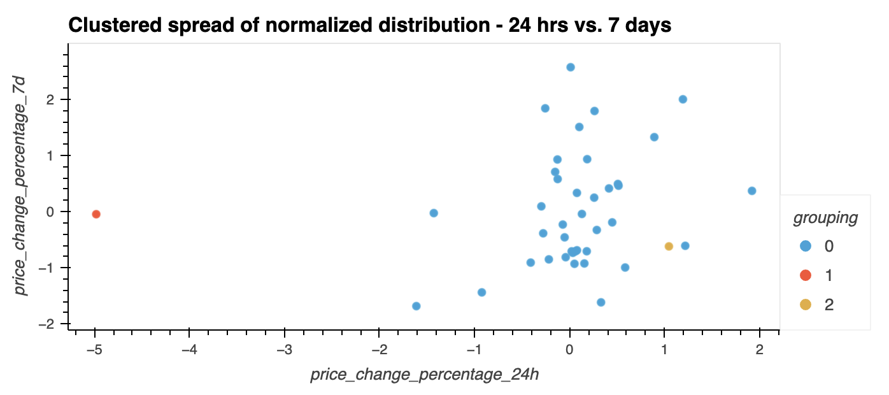
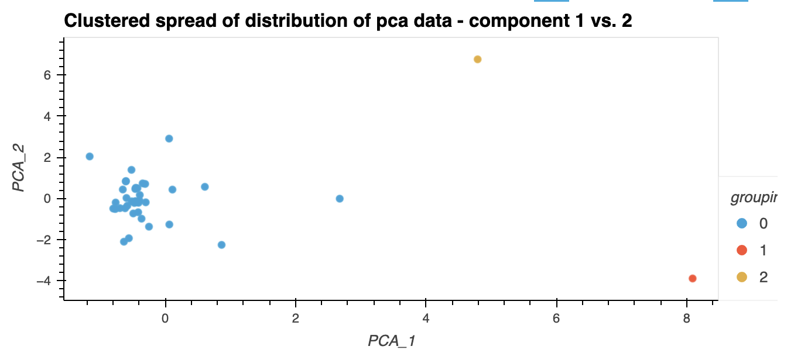

# Project-Crypto_Analysis - Applying Principal Component Analysis (PCA)

## Limitations of traditional cluster visualization

The human eye is limited to viewing a 3D space, so it becomes complicated to effectively display distinctive clustering of data when we have more than 3 dimensions to analyze. One tedious and rather clunky alternative would be to show multiple 3D clusters that cover every possible permutations of the dimentions (not pretty!). 

When randomly selecting 2 dimensions to view the clusters in, it is difficult to visualize how the clusters were made:

## Advantage of PCA

With PCA, we're able to target our analysis towards the most significant information to better understand the data; which enables us to visualize the difference between clusters when there are more than 3 dimensions. 

I ran a PCA analysis on the same data, and now we can clearly see the relative difference between the outlying cryptos and the rest of the portfolio:

## Conclusion

When warrented, we should apply PCA analysis to speed up and increase the impact of our analysis.
